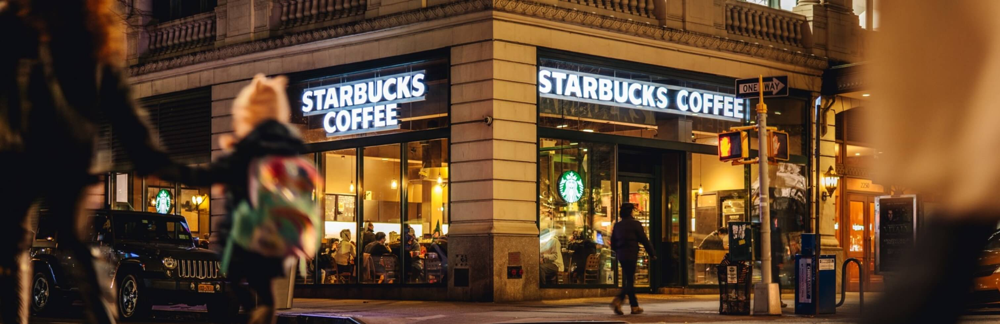

# Starbucks Homepage clone coding

### <a href="https://candid-tartufo-8d3a83.netlify.app/">Check the result </a>

## Excercise
- The Open graph Protocol
- Twitter Cards

## Use
- **Google Font** (Nanum-gothic)
- _Google material Icon_
- GSAP & ScrollToPlugin (The GreenSock Animation Platform)
- ~~Swiper (https://swiperjs.com/get-started)~~
- Scroll Magic for starting animation by scroll

## SPA with sign-in page
[Sign-in page](https://candid-tartufo-8d3a83.netlify.app/signin/)


> Open graph
```html
 <meta property="og:type" content="website" />
  <meta property="og:site_name" content="Starbucks" />
  <meta property="og:title" content="Starbucks Coffee Korea" />
  <meta property="og:description" content="Biggest coffee franchise in 64 countries" />
  <meta property="og:image" content="./images/starbucks_seo.jpg" />
  <meta property="og:url" content="https://starbucks.co.kr" />

```

---